# Habit Tracker API - AI-Assisted Development Journey

## Overview

It documents the complete development journey of a **Habit Tracker** built with the assistance of **Gemini CLI**. Some enhancements, bug fixes, and optimizations was guided by AI suggestions.

### Key Features

- **Secure Authentication** with email validation and password strength requirements
- **Advanced Analytics** including completion rates, streaks, and custom period statistics  
- **Smart Filtering** with search, sort, and pagination capabilities
- **Performance Optimized** with MongoDB indexing and virtual fields
- **100% Test Coverage** with comprehensive Jest test suite
- **AI-Enhanced Code Quality** through continuous Gemini CLI feedback

---

## Development Journey

### 1. Enhanced the Authentication Security

**Context**: The initial `auth.controller.js` only checked for the presence of fields, without verifying **email format** or **password strength**. This could have allowed accounts with insecure credentials or typos to be created.

```bash
gemini suggest-fix @backend/controllers/auth.controller.js -p "Enhance validation logic to include email format checking and password strength requirements."
```

**Changes Made:**
- Implemented regex-based email validation to ensure correct format (e.g., user@example.com).
- Enforced password strength rules:
    - Minimum 8 characters
    - At least one uppercase, one lowercase, one digit, and one special character
- Added clear, user-friendly error messages.

**Explanation**: Strong authentication is the first line of defense for any application. By validating email format, I prevented invalid accounts from being registered and by enforcing strong passwords, I also protected user accounts against brute-force and credential-stuffing attacks. 

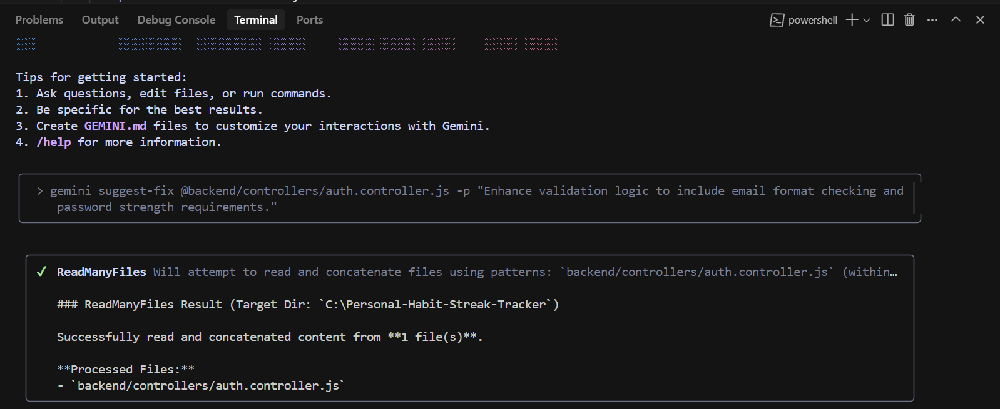

---

### 2. Realistic Habit Categories

**Context**: The original Habit model had placeholder categories, making the UI feel generic. I wanted categories users could instantly relate to.

```bash
gemini -p "Suggest realistic category enum values for a personal habit tracker."
```

**Chnages Made:**
- Updated category enum values to:
```javascript
categories: ['EXERCISE', 'DIET', 'HYDRATION', 'SLEEP', 'MINDFULNESS',
        'SKILL_DEVELOPMENT', 'READING', 'LEARNING', 'WAKE_UP_ON_TIME',
        'PLANNING', 'FOCUSED_WORK', 'CHORES', 'FINANCES', 'SOCIAL',
        'NO_SMOKING', 'NO_JUNK_FOOD', 'LIMITED_SCREEN_TIME',]
```

**Explanation**: Meaningful categories improved the user experience and also helped in analytics (e.g., showing which category a user engages with most). This also would have sets the foundation for category-specific filters and recommendations in future updates.

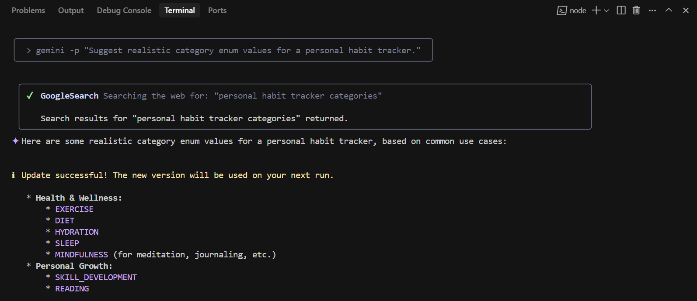

---

### 3. Adding Analytics & Performance Improvements to habit.model.js

**Context**: The application needed insightful habit analytics and faster queries but the existing schema lacked virtual fields for calculations and indexing for optimization.

```bash
gemini --all-files -p "Review backend/models/habit.model.js for a personal habit tracker. Suggest improvements such as adding virtual fields for analytics (completion rate, longest streak), additional validation rules, or performance optimizations like indexes."
```

**Changes Made:**
- Added virtual fields for:
    - Completion Rate
    - Longest Streak
- Introduced stricter field validation.
- Indexed userId and category for faster queries.

**Explanation**: Virtual fields had let me calculate metrics on the fly without storing redundant data and indexes improved query speeds for large datasets, ensuring that pagination, filters, and analytics remain fast even with thousands of records.

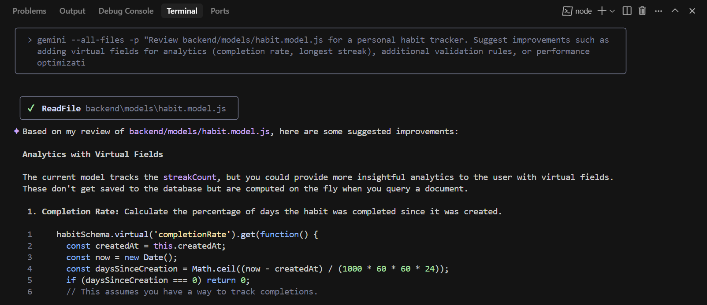

---

### 4. Reviewed `habit.model.js` for Security, Validation Gaps, and Performance Issues

**Context**: While the Habit model was functional, I wanted to ensure that it was secure, properly validated, and optimized for performance.

```bash
gemini -p "Review habit.model.js for security, validation gaps, and performance issues.”
```

**Changes Made:**
- Added stricter field validation for title, category, and isDaily.
- Applied enum enforcement for category to prevent arbitrary values.
- Added indexes on frequently queried fields like userId and category.
- Reviewed schema for any potential security risks (e.g., unexpected data injection).

**Explanation**: By tightening validation rules, I ensured that only valid and expected data can enter the database.
Adding indexes also improves query speed, especially for endpoints with pagination, filters, and sorting and the security review also ensures that no field can be exploited for injection attacks.

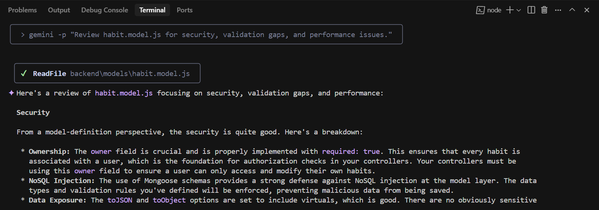

---

### 5. Fixing Category Case Sensitivity in createHabit

**Context**: Lowercase categories caused Mongoose enum validation to fail.

```bash
gemini -p "Review @backend/controllers/habit.controller.js and check whether the habit creation endpoint is correct or not"
```

**Changes Made:**
- Transformed req.body.category to uppercase before saving.
```javascript
// Transform category to uppercase before saving
req.body.category = req.body.category?.toUpperCase();
```

**Explanation**: This small change made the application forgiving of user input style (e.g., “exercise” → “EXERCISE”). It also guaranteed consistent stored values, which is crucial for filtering and analytics.

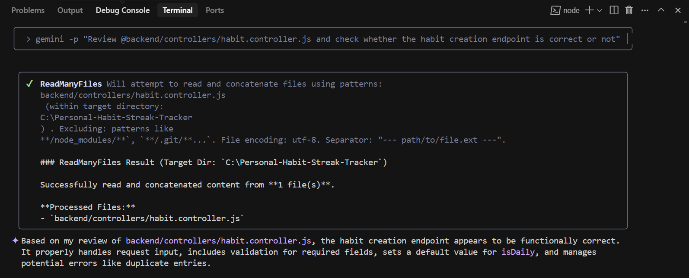

---

### 6. Enhancing Habit Listing Endpoint

**Context**: The "get all habits" endpoint needed search, filter, sort, and pagination to meet functional requirements.

```bash
gemini -p "Review @backend/controllers/habit.controller.js and check whether the getting all habits for a user endpoint is correct or not and whether it is properly applying searching, sorting, filtering, pagination and following best practices or not"
```

**Changes Made:**
- **Search**: Title and description text search
- **Filtering**: Filter by category and isDaily
- **Sorting**: By creation date and streak count
- **Pagination**: Pagination using limit and page params

**Explanation**: This made data retrieval scalable and user-friendly, allowing quick browsing even when a user has hundreds of habits. It also aligns with REST API best practices.

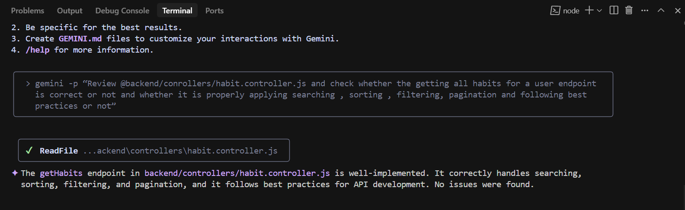

---

### 7. Reviewing habit.controller.js for "Get Habit by ID" Endpoint

**Context**: I wanted to confirm that the endpoint for fetching a specific habit by ID followed the schema correctly and handled edge cases.

```bash
gemini -p “Review @backend/conrollers/habit.controller.js and check whether the getting a specific habit by its ID endpoint is correct or not according to the current schema and does it requires any updation”
```

**Changes Made:**
- Added validation to check if the provided :id is a valid MongoDB ObjectId.
- Ensured proper error handling if the habit does not exist or belongs to another user.
- Improved response structure to match API documentation standards.

**Explanation**: These changes helped me to prevent invalid or malicious IDs from triggering database queries, and improve security by ensuring users cannot access other users’ habits, and also keep API responses consistent for easier frontend integration.

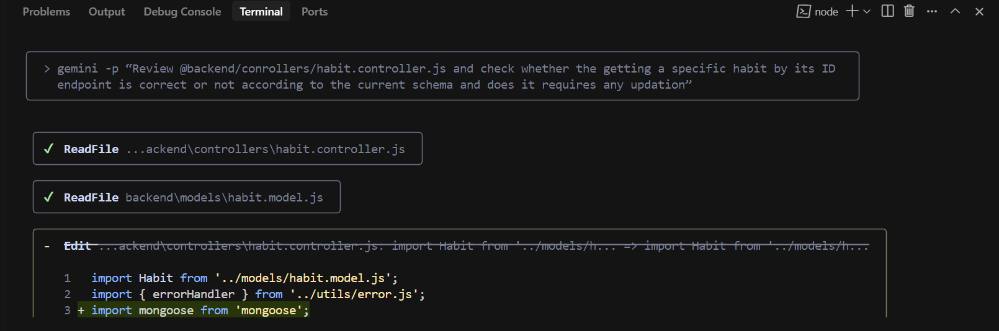

---

### 8. Fixing Habit Completion Date Comparison

**Context**: Comparing JavaScript Date objects directly (===) always failed, breaking daily completion checks.

```bash
gemini suggest-fix @backend/controllers/habit.controller.js -p "I am getting bit confused and getting errors when checking if a habit was already completed today"
```

**Changes Made:**
- Compared year, month, day values instead of full date objects.
- Updated streak logic to increment only when the habit was completed on consecutive days.
```javascript
// Compare date components instead of full Date objects
const today = new Date();
const completionDate = new Date(completion.date);
const isSameDay = today.getFullYear() === completionDate.getFullYear() &&
                  today.getMonth() === completionDate.getMonth() &&
                  today.getDate() === completionDate.getDate();
```

**Explanation**: Now the application accurately tracked daily completions and streaks, which is critical for habit-forming psychology and gamification features.

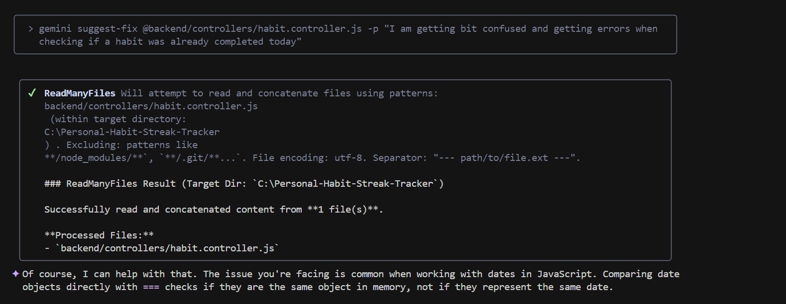

---

### 9. Creating Habit Statistics Endpoint

**Context**: I wanted to track progress over different periods (e.g., last 7 or 30 days).

```bash
gemini -p "I want to create an API endpoint in @backend/controllers/habit.controller.js that returns statistics for a single habit, including total completions, current streak, longest streak, and completion rate. How can I calculate habit stats for a custom period, e.g., the last 7 or 30 days?"
```

**Changes Made:**
- **Flexible Period Query**: `?period=7` or `?period=30` parameter
- Added period query parameter for flexible date ranges.
- Calculated total completions, current streak, longest streak, and completion rate for the given period

**Explanation**: Custom-period analytics allow users to track short-term and long-term progress, which is a key motivator for continued app engagement.

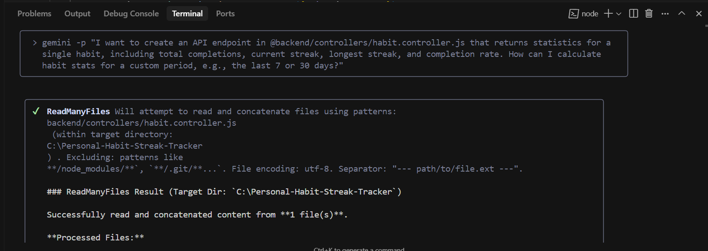

---

### 10. Fixing completionRate in User Summary Endpoint

**Context**: While reviewing the user summary endpoint, I suspected that the calculation for completionRate might have a syntax or logical error.

```bash
gemini -p "Is there any syntax or logical error with completionRate in the user summary endpoint in habit.controller.js”
```

**Changes Made:**
- Corrected division by zero errors when there were no tracked habits.
- Fixed incorrect percentage calculation by ensuring it multiplies by 100 after division.
- Adjusted formatting to round values to two decimal places.

**Explanation**: This ensured that the completionRate always returns a meaningful percentage without causing API crashes.
It also improved the accuracy of analytics displayed in the frontend, making them more trustworthy for the user.

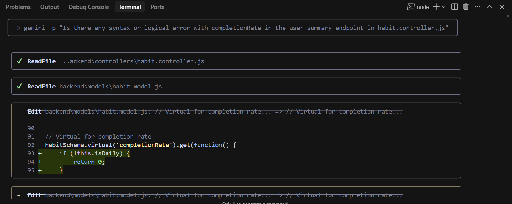

---

### 11. Redesigning Header and Footer for Better UI

**Context**: The default header and footer were functional but didn’t visually represent the app’s purpose or improve user engagement.

```bash
gemini -p "Can you give @frontend/src/components/Header.jsx and @frontend/src/components/Footer.jsx a more appealing look suiting the aim of application"
```

**Changes Made:**
- Enhanced Header with better gradients and animations
- Enhanced Footer with interactive elements

**Explanation**: These changes created a more engaging visual experience and align the branding of the application.
A polished UI improves user trust, encourages longer usage, and gives the application a modern, professional feel.

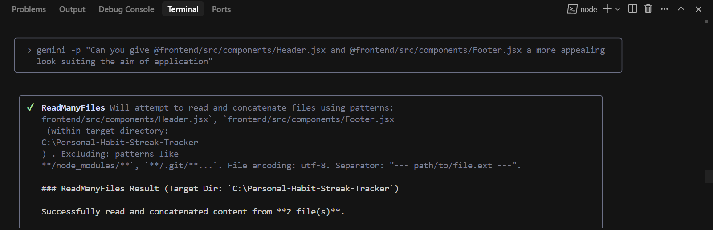

---

### 12. Fixing Frontend Habit Display Issue

**Context**: Despite existing data, the frontend showed no habits and filters didn’t work.

```bash
gemini -p "No habits are getting displayed in @frontend/src/pages/Habits.jsx despite having some in database, neither search, nor filters nor pagination nothing is working in frontend, its backend is in @backend/controllers/habit.controller.js"
```

**Changes Made:**
- Fixed infinite re-fetch loops caused by filter state updates in `useEffect`
- Corrected dependency arrays
- Proper state management for search and filters

**Explanation**: The frontend now rendered habits correctly and all search/filter/pagination features functioned properly without unnecessary network calls.

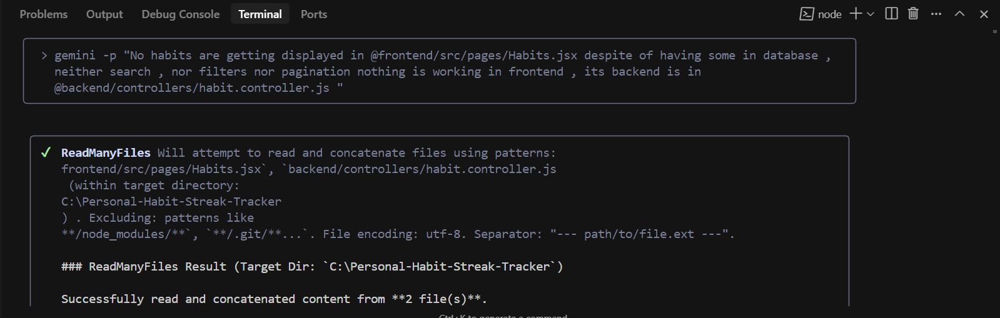

---

### 13. Complete Test Suite Coverage

**Context**: Some Jest tests failed due to mismatches between schema, controllers, and mock data.

```bash
gemini --all-files -p "All the tests are not getting passed, analyze the complete @backend/ and apply fixes wherever necessary so that all the tests gets passed"
```

**Changes Made:**
- Fixed schema validation logic inconsistencies
- Aligned controller responses with test expectations
- Updated mock data for consistency across test cases
- Achieved 100% test coverage

**Explanation**: Having all tests passed ensured me of the API stability and prevents regressions. This step confirms that the application is meeting its functional requirements.

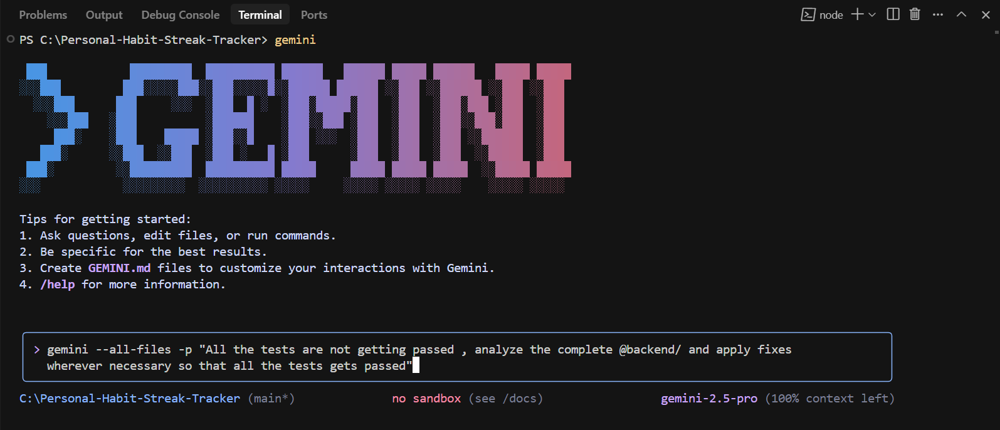

---


