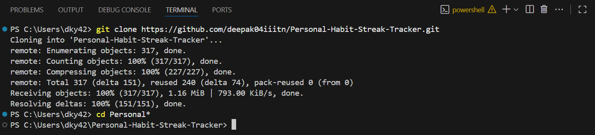
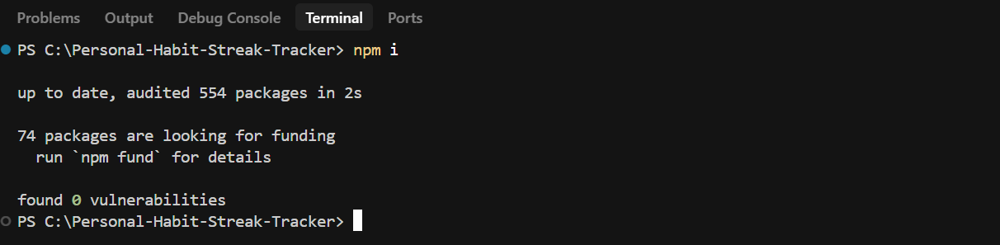
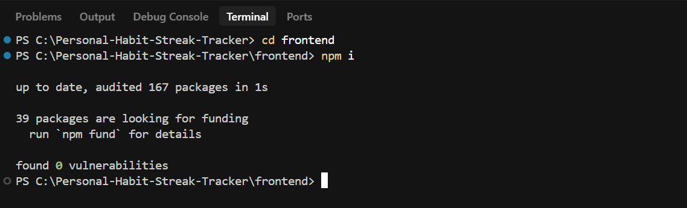
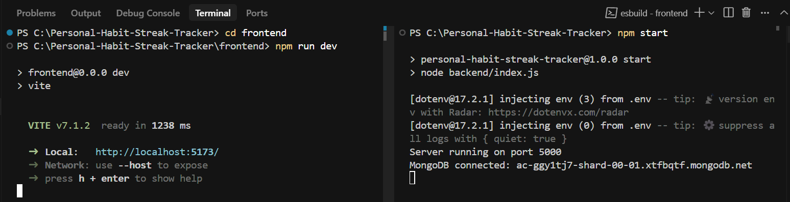
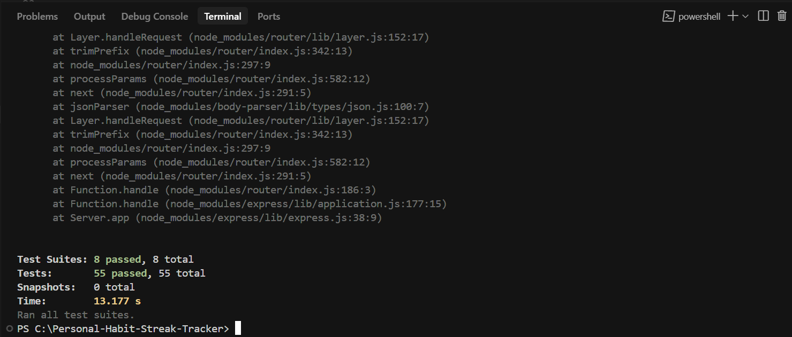
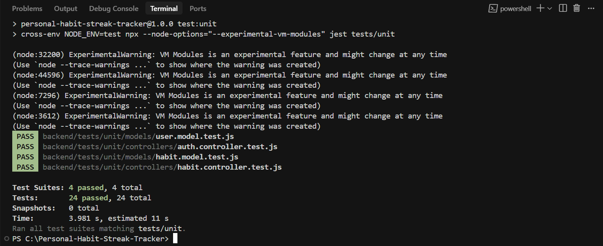
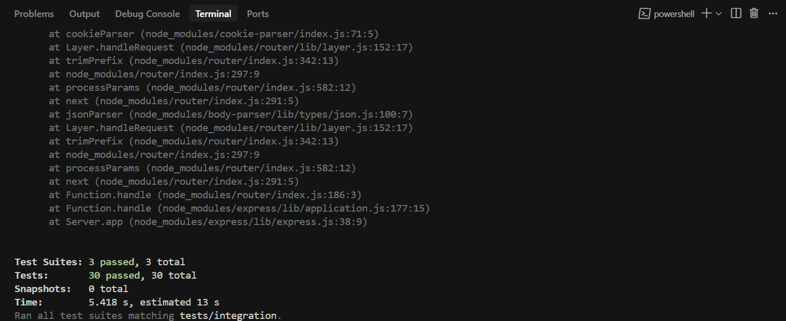
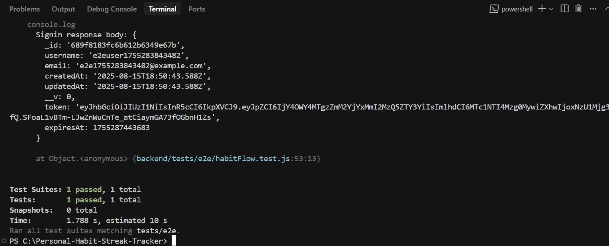

# 📆 Personal Habit Streak Tracker

A **MERN stack** application to help you track your habits, maintain streaks, and stay consistent.  
This repository contains both the **backend** (Node.js, Express, MongoDB) and **frontend** (React + Tailwind CSS) code.

---

## Local Setup Guide

Follow these steps to set up the project locally:

### 1️. Clone the Repository
```bash
git clone <repository_url>
```

### 2. Move into the Root Directory
```bash
cd Personal-Habit-Streak-Tracker
```



### 3. Install Backend Dependencies
```bash
npm i
```



### 4. Move into the Frontend Directory
```bash
cd frontend
```


### 5. Install Frontend Dependencies
```bash
npm i
```



### 6. Go Back to the Root Directory
```bash
cd..
```

--- 

## Environment Variables Setup

### 1. Create .env file in the root directory:
```bash
MONGODB_URI = <your_mongodb_connection_string>
PORT = <your_port>
JWT_SECRET = <your_jwt_secret_key>
```


### 2. Create .env.test file in the root directory (for testing) and copy these values:
```bash
JWT_SECRET = test-secret-key-for-testing
NODE_ENV = test
MONGODB_TEST_URI = mongodb://localhost:27017/habit-tracker-test
```

--- 

## Starting the Application

### 1. Start the backend (from the root directory):
```bash
npm start
```


### 2. Start the frontend (in a separate terminal):
```bash
cd frontend
npm run dev
```


---

## Running Tests

From the root directory, you can run all of these:

### 1. Run all tests
```bash
npm test
```



### 2. Run only unit tests
```bash
npm run test:unit
```



### 3. Run only integration tests
```bash
npm run test:integration
```



### 4. Run end-to-end (E2E) tests
```bash
npm run test:e2e
```


---

